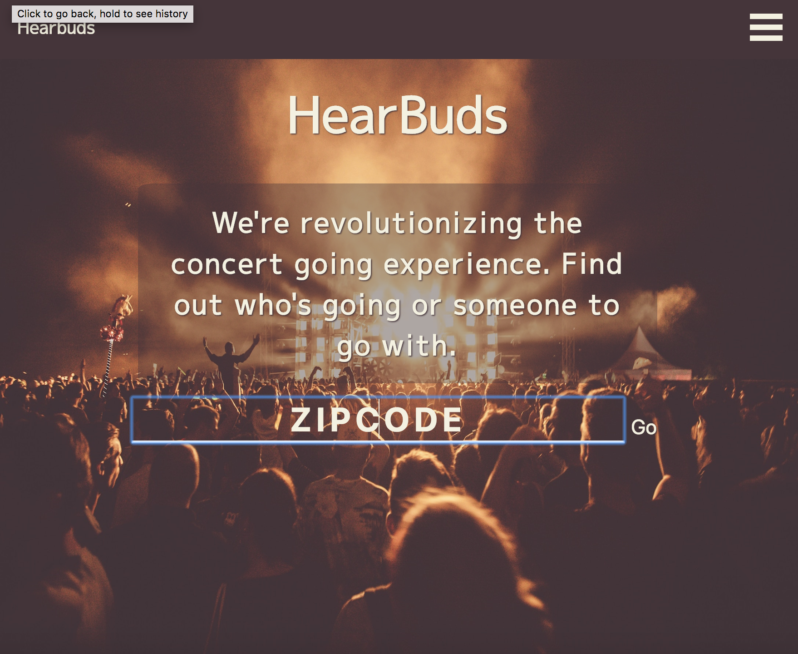
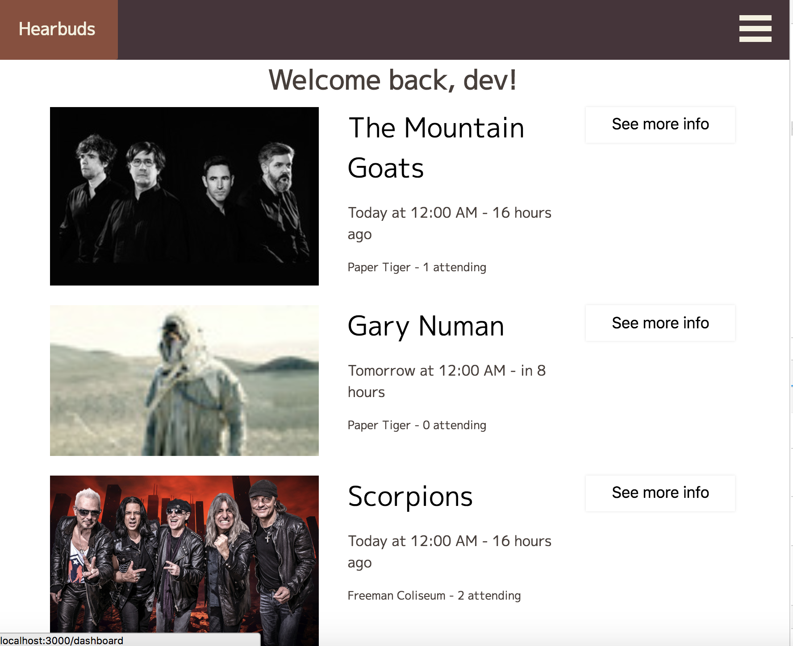
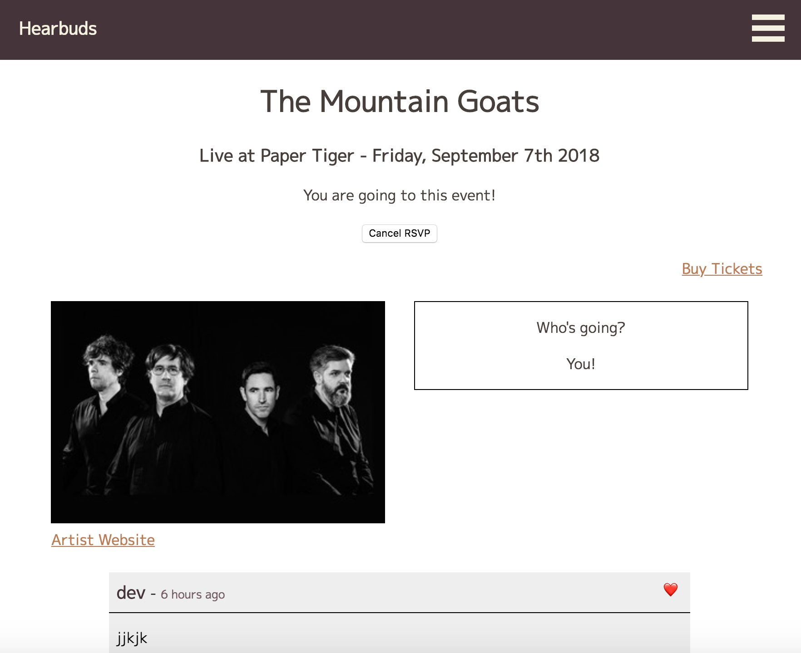

# HearBuds

## Revolutionizing the concert going experience.

HearBuds allows users to find concerts in their area and find someone to go with.

_____________________
## Link to the live version
 -[live app](https://hearbuds-client.firebaseapp.com/)
 -[client repo](https://github.com/thinkful-ei21/hearbuds-client)

 ____________________
 ## Screenshots

_____________________

## Tech stack

* HTML5
* Cascading Style Sheet/Flex Box
* JavaScript
* NodeJS
* GraphQL
* MongoDB

### Client-Side

* React
* React Redux
* Redux Thunk
* JWT-Decode
* Deployed with Firebase

### Server-Side

* Express
* Mongoose
* Morgan
* Passport
* JSONWedToken
* Bcryptjs
* Deployed with Zeit

## Dev setup

* Clone both repos (this one and the [Client Repo](https://github.com/thinkful-ei21/hearbuds-client))

* Once you have them cloned run `npm install` on both in order to get all dependancies.

* Run `npm start` to get the app running locally